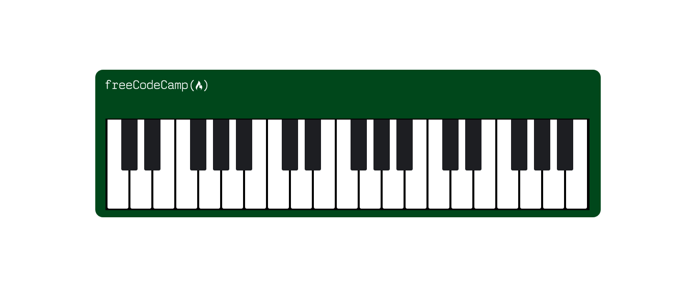

## Free Code Camp Piano Project 


## Description
This project is a simple webpage showcasing a virtual piano.

## Technologies Used
- HTML
- CSS

```html
<div class="keys">
            <div class="key"></div>
            <div class="key black--key"></div>
            <div class="key black--key"></div>
            <div class="key"></div>
            <div class="key black--key"></div>
            <div class="key black--key"></div>
            <div class="key black--key"></div>
        </div>

```


## Features
- Virtual piano 
- Responsive design

## Preview

