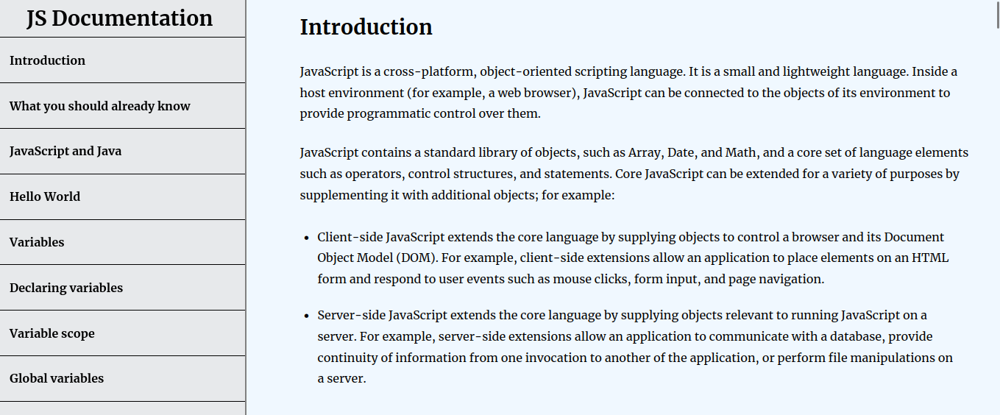

# Free Code Camp Technical Docs. Project

## Overview

Brief description of your HTML and CSS project and its objectives.

## Usage

Instructions on how to use your project, including any HTML structure and CSS styling details.

## Screenshots

Include screenshots or links to screenshots of your project's interface.

## Code Snippets

```html
<!DOCTYPE html>
<html lang="en">

<head>
    <meta charset="UTF-8">
    <meta name="viewport" content="width=device-width, initial-scale=1.0">
    <title>Tech Docs</title>
    <link rel="stylesheet" href="./css/styles.css">
</head>

<body>
<nav id="navbar">
        <header>JS Documentation</header>

        <ul>
            <li><a href="#Introduction" class="nav-link">Introduction</a></li>
            <li><a href="#What_you_should_already_know" class="nav-link">What you should already know
                </a></li>
            <li><a href="#JavaScript_and_Java" class="nav-link">JavaScript and Java
                </a></li>
            <li><a href="#Hello_world" class="nav-link">Hello World</a></li>
            <li><a href="#Variables" class="nav-link">Variables</a></li>
            <li><a href="#Declaring_variables" class="nav-link">Declaring variables
                </a></li>
            <li><a href="#Variable_scope" class="nav-link">Variable scope
                </a></li>
            <li><a href="#Global_variables" class="nav-link">Global variables
                </a></li>
            <li><a href="#Constants" class="nav-link">Constants</a></li>
            <li><a href="#Data_types" class="nav-link">Data types
                </a></li>
            <li><a href="#if...else statement" class="nav-link">if...else statement
                </a></li>
            <li><a href="#while_statement" class="nav-link">while statement
                </a></li>
            <li><a href="#Function_declarations" class="nav-link">Function declarations
                </a></li>
            <li><a href="#Reference" class="nav-link">Reference</a></li>
        </ul>
    </nav>


    </body>
 </html>   

```

```css

* {
    margin: 0;
    padding: 0;
    box-sizing: border-box;
}

html {
    scroll-behavior: smooth;
}

body {
    min-height: 100vh;
    font-family: "Merriweather", serif;
    color: #000;
    background-color: aliceblue;
    line-height: 1.8;


}

header {
    font-size: 1.75rem;
    font-weight: 700;
    margin: 0.5rem 0.25rem;
    text-align: center;
}

/* Navigation bar css */
nav {

    width: 25%;
    height: 100%;
    background-color: #e7e9eb;
    position: fixed;
    top: 0;
    left: 0;
    z-index: 1;
    min-width: 23%;
    overflow: auto;
    border-right: 2px solid gray;
}

nav header {
    margin: 0 0.5rem;
    padding: 0 1.25rem;
   
}

nav ul {
    list-style-type: none;
}

nav ul li {
    width: 100%;
}

nav ul li:first-child {
    border-top: 1px solid #000;
}

nav ul li:last-child {
    margin-bottom: 5px;
}

nav ul li a {
    padding: 1rem 1.25rem;
    text-align: left;
    border-bottom: 1px solid #000;
    font-family: "Merriweather", serif;
    display: block;
    width: 100%;
    text-decoration: none;
    color: #000;
    font-weight: 700;
}

nav ul li a:hover {
    background-color: #04AA6D;
    color: #f5f5f5;
    cursor: pointer;
}


```

## ScreenShot




